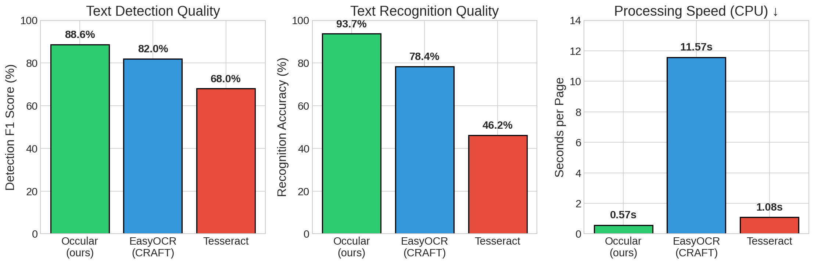

# Occular OCR

**Быстрый и точный OCR для русскоязычных документов.**

- **В 20 раз быстрее** EasyOCR на CPU
- **В 2 раза точнее** Tesseract на русском тексте
- **~1 секунда на страницу** на современном CPU (ONNX Runtime)
- Простой API: всего 3 строки кода
- GPU поддерживается, но библиотека оптимизирована под CPU

<p align="center">
  
</p>

|  | Occular | EasyOCR | Tesseract |
|--|---------|---------|-----------|
| **Детекция F1** | 88.6% | 82.0% | 68.0% |
| **Точность распознавания** | 93.7% | 78.4% | 46.2% |
| **Скорость (CPU)** | 0.57 сек/стр | 11.57 сек/стр | 1.08 сек/стр |

---

## English

**Fast and accurate OCR for Russian documents.**

- **20x faster** than EasyOCR on CPU
- **2x higher accuracy** than Tesseract on Russian text
- **~1 second per page** on modern CPU (ONNX Runtime)
- Simple API: just 3 lines of code
- GPU supported, but optimized for CPU inference

|  | Occular | EasyOCR | Tesseract |
|--|---------|---------|-----------|
| **Detection F1** | 88.6% | 82.0% | 68.0% |
| **Recognition Accuracy** | 93.7% | 78.4% | 46.2% |
| **Speed (CPU)** | 0.57 sec/page | 11.57 sec/page | 1.08 sec/page |

---

## Установка / Installation

```bash
pip install -e .
```

## Использование / Usage

### Простой API (3 строки)

```python
from ocr_skel import ocr

text = ocr("photo.png")
print(text)

# PDF возвращает список строк (по одной на страницу)
pages = ocr("document.pdf")
print(pages[0])
```

### Продвинутый API

```python
from ocr_skel import OCRPipeline

pipeline = OCRPipeline(onnx=True, gpu=False)

# Изображение с координатами
results = pipeline.process_image("photo.png")
for r in results:
    print(f"{r['text']} ({r['confidence']:.1%})")

# PDF с параллельной обработкой
results = pipeline.process_pdf("document.pdf", dpi=300, workers=4)
```

### CLI

```bash
ocr photo.png                    # Распознать изображение
ocr document.pdf                 # Распознать PDF
ocr scan.pdf --workers 4         # 4 воркера для PDF
ocr photo.png --json             # Вывод с координатами
ocr photo.png -o result.json     # Сохранить в файл
```

## Формат вывода / Output Format

```json
[
  {
    "quad": [[x1, y1], [x2, y2], [x3, y3], [x4, y4]],
    "text": "распознанный текст",
    "confidence": 0.95
  }
]
```

## Тестирование / Testing

```bash
pytest -q
```

## Лицензия / License

- **Код**: GPL-3.0
- **Веса моделей**: [MODEL_LICENSE.md](MODEL_LICENSE.md) 
