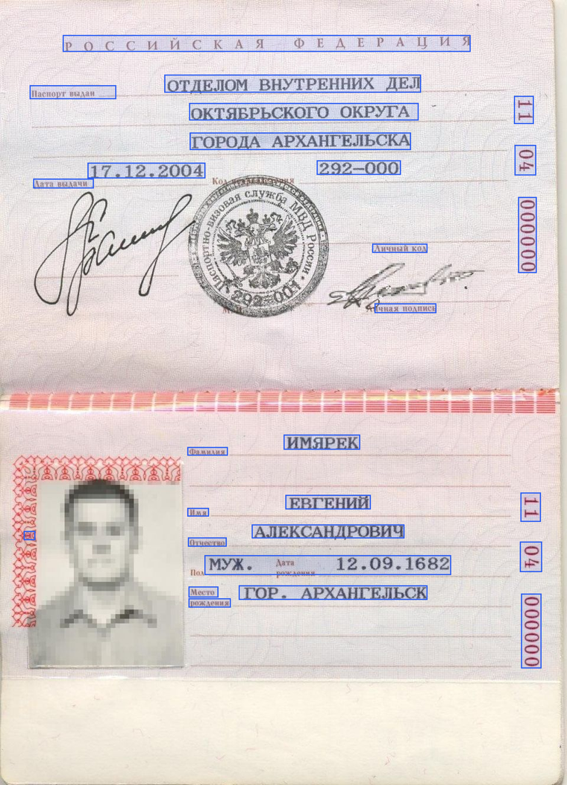
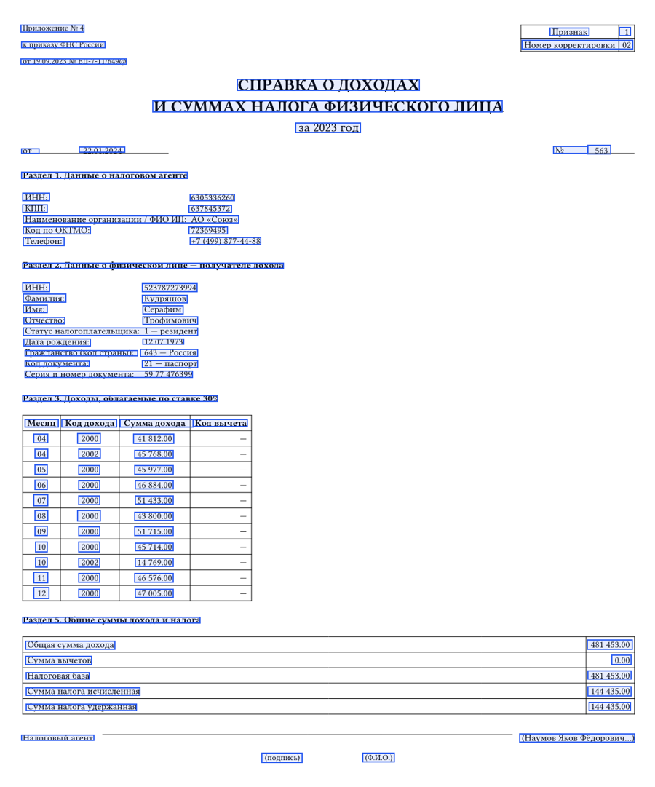
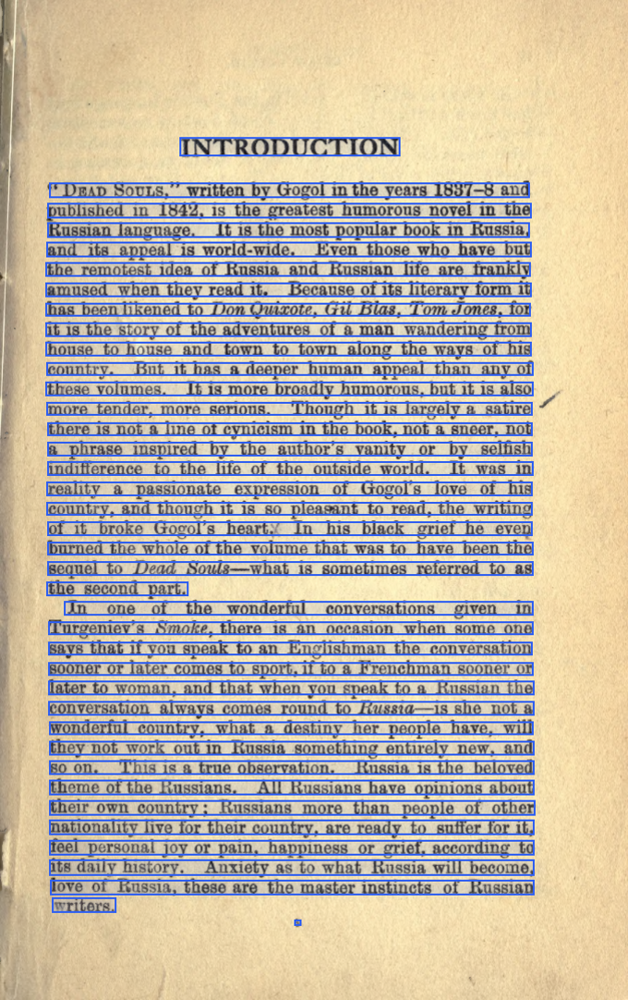
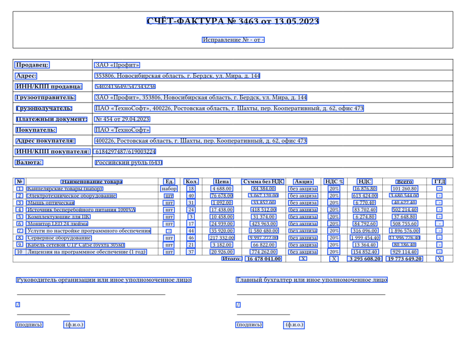
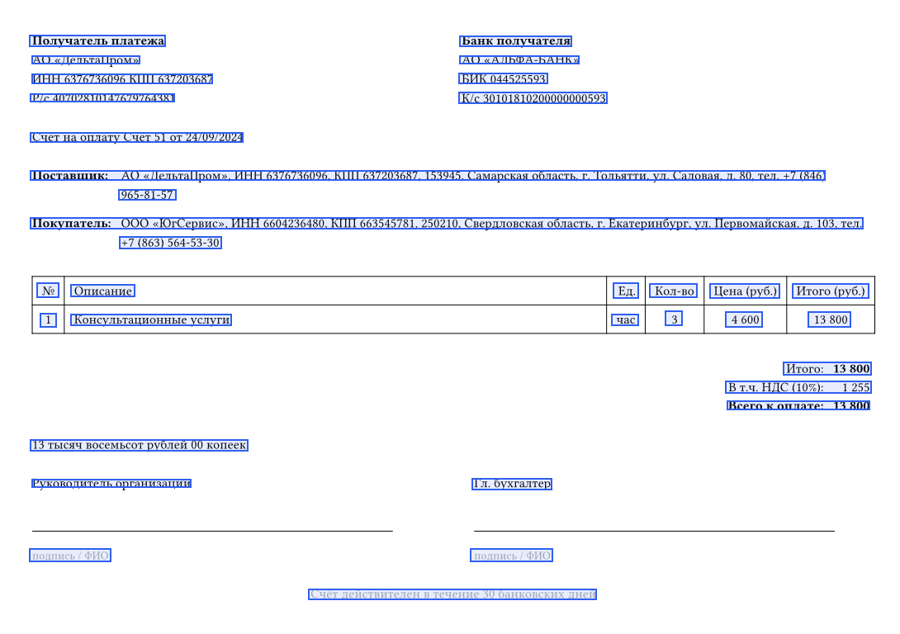

<div align="center">

# Occular-OCR

**State-of-the-art OCR for Russian documents — with a zero-compilation install.**

[](LICENSE)
[](WEIGHTS_LICENSE.md)
[](#installation)
[](#installation)

<sub>🇬🇧 **English** &nbsp;·&nbsp; <a href="#russian">🇷🇺 Русский</a></sub>

</div>

Occular-OCR is a document OCR library purpose-built for **Russian**. It pairs a DBNet text detector with an
SVTR recognizer and a beam-search decoder guided by a Russian language model — and reads Russian
documents **markedly better than existing open-source OCR**, especially the hard stuff: forms,
certificates, bank statements, IDs, receipts.

It installs with a single `pip install` on Windows, Linux and macOS — **no C/C++ toolchain, no CUDA,
nothing to build.**

---

## See it in action

<p align="center">
  
  
  
</p>
<p align="center">
  
  
</p>

<p align="center"><sub>Detected text lines on <b>synthetic / specimen / public-domain</b> documents — a passport, a tax certificate, a printed book page, a VAT invoice, a payment invoice.</sub></p>

## Why Occular-OCR

Occular-OCR is built for Russian and reads it dramatically better than existing open-source OCR:
**~35 % fewer word errors than the next-best open-source engine** in an end-to-end benchmark, and
ranking **#1** against large vision-language models and other leading OCR engines on a page-level
document benchmark. The gap is widest exactly where general-purpose OCR struggles: dense forms,
certificates, invoices and IDs.

- **Russian-first accuracy.** Trained and tuned on Russian document data. Where other engines guess,
  Occular-OCR reads.
- **Beam + language model, on by default.** A Russian n-gram language model cuts word errors
  ~18–25 % over plain greedy decoding — with **no model retraining**, just better decoding.
- **Fast by default.** The default recognizer (`svtr_lcnet`) reads a dense page about **5× faster**
  on CPU than the previous one while keeping 99.6 % of its accuracy. The larger model is still one
  argument away: `recognizer="svtr_t"`.
- **Handles sideways pages.** Turn on `orientation=True` and Occular detects a 0/90/180/270°
  rotation and straightens the page before reading it — for phone photos and bulk scans that come
  in rotated. Off by default; it only rotates when it is confident.
- **Installs anywhere, no compiler.** The decoder is pure Python end to end, so you get top-tier
  decoding quality with **zero native dependencies**.
- **CPU-first, GPU-ready.** Ships as ONNX and runs on CPU out of the box; set `gpu=True` to run natively on PyTorch/CUDA (`occular-ocr[gpu]`).
- **Batteries included.** Images and PDF, folder → `.txt`, reading order, automatic deskew.

---

## Installation

```bash
pip install occular-ocr
```

That's it. No build tools, no CUDA. Model weights download automatically on first use and are cached
locally.

### GPU (optional)

On GPU the pipeline runs natively on **PyTorch/CUDA** (more robust across CUDA/cuDNN versions than
onnxruntime-gpu). It uses the same trained weights, so output matches the CPU path bit-for-bit.
Install the GPU extra:

```bash
pip install occular-ocr[gpu]      # pulls in torch + torchvision
```

Then pass `gpu=True` (see below). The PyTorch weights download automatically on first GPU use.
If PyTorch or CUDA isn't available, it falls back to CPU (ONNX) with a warning.

---

## Quick start

```python
from occular import ocr

text = ocr("document.png")        # an image, or a "scan.pdf"
print(text)
```

Line-level output with coordinates and confidence:

```python
from occular import ocr_detailed

for line in ocr_detailed("document.png"):
    print(line["text"], round(line["confidence"], 2), line["quad"])
```

A whole folder → text files, from the command line:

```bash
ocr ./scans ./out          # writes ./out/<name>.txt for every image/PDF
```

> First run downloads the model weights automatically (and caches them). No build tools, no CUDA.

## Configuration

All behaviour is controlled by `Settings` (or the equivalent keyword arguments on `ocr`). Print the
current defaults at any time:

```python
from occular import Settings
print(Settings())
```

| Setting | Default | What it does |
|---|---|---|
| `num_threads` | `None` | CPU threads for inference. `None` → `min(cores, 4)`. |
| `gpu` | `False` | Run on **GPU via PyTorch/CUDA**. Needs `occular-ocr[gpu]` (torch+torchvision); falls back to CPU (ONNX) if unavailable. |
| `orientation` | `False` | Detect a 0/90/180/270° page rotation and straighten it before detection — for phone photos and bulk scans that arrive sideways. Applied only when the model is at least 0.8 confident. |
| `deskew` | `True` | Auto-correct skewed scans (a few degrees) before detection. |
| `lm` | `True` | Beam search + language model (best quality). `False` → fast greedy decoding, skips the LM download. |
| `reading_order` | `False` | Order lines for multi-column layouts (downloads a small model on first use). |
| `languages` | `None` | Text language(s). `None` → Russian/English. A list of codes (e.g. `["uk"]`) or `"auto"` enables the multilingual model (12 more Cyrillic-script languages). See [Languages](#languages). |
| `detector` | `None` | Explicit detector name. `None` → default. |
| `recognizer` | `None` | Recognizer architecture: `"svtr_lcnet"` (default — light, ~5× faster on CPU) or `"svtr_t"` (the larger model; the only one supported on GPU). |

### Full pipeline with every setting

```python
from occular import OCRPipeline, Settings

pipe = OCRPipeline(Settings(
    num_threads=8,        # CPU threads (None -> min(cores, 4))
    gpu=False,            # True -> PyTorch/CUDA (needs occular-ocr[gpu])
    orientation=False,    # detect 0/90/180/270 rotation and straighten the page
    deskew=True,          # auto-correct skewed scans
    lm=True,              # beam + language model; False -> greedy (faster, no LM download)
    reading_order=False,  # multi-column reading order (optional model, see below)
    detector=None,        # None = default detector
    recognizer=None,      # None = svtr_lcnet; "svtr_t" = the larger model
))

result = pipe.process_image("document.png")
# -> [{"quad": [[x, y], ...], "text": "...", "confidence": 0.97}, ...]
```

### PDF: render DPI and parallel workers

```python
pages = pipe.process_pdf(
    "document.pdf",
    dpi=300,          # render resolution for scanned PDFs (default 300)
    force_ocr=False,  # True: OCR even PDFs that already have a text layer
    workers=4,        # parallel pages (None = auto min(cores, 4); 1 = sequential)
)
```

| PDF option | Default | What it does |
|---|---|---|
| `dpi` | `300` | Render resolution for scanned PDFs. Lower to `200` for speed on large batches. |
| `force_ocr` | `False` | OCR even PDFs that already contain a text layer. |
| `workers` | `None` | Parallel pages. `None` → auto `min(cores, 4)`; `1` → sequential. |

### One-liners

```python
from occular import ocr

ocr("document.png")                 # CPU (default), full quality
ocr("document.png", gpu=True)       # GPU via PyTorch/CUDA (needs occular-ocr[gpu])
ocr("document.png", lm=False)             # fast greedy mode, no LM download
ocr("document.png", deskew=False)         # skip deskew
ocr("photo.jpg",    orientation=True)     # straighten a sideways page first
ocr("document.png", recognizer="svtr_t")  # the larger recognizer instead of the default
ocr("document.png", num_threads=2)  # limit CPU threads
```

### Languages

By default Occular reads **Russian and English**. Pass `languages=` to switch on the multilingual
model, which adds **12 more Cyrillic-script languages**: Bashkir (`ba`), Belarusian (`be`),
Bulgarian (`bg`), Chuvash (`cv`), Kazakh (`kk`), Kyrgyz (`ky`), Macedonian (`mk`), Mongolian (`mn`),
Serbian (`sr`), Tajik (`tg`), Tatar (`tt`), Ukrainian (`uk`).

```python
from occular import ocr

ocr("doc_uk.png", languages=["uk"])          # a single language — fastest
ocr("mixed.png",  languages=["ru", "kk"])    # several — language is detected per line
ocr("scan.png",   languages="auto")          # auto-detect across all supported languages
```

```bash
ocr doc_uk.png --languages uk                # or --lang uk
ocr mixed.png  --languages ru,kk
ocr scan.png   --languages auto
```

The right language weights download from the Hub on first use (only the ones you ask for). More
languages are added over time in minor releases.

### Command line

```bash
# Single file — text to stdout
ocr document.png
ocr document.pdf --workers 4 --dpi 300

# Whole folder → one .txt per file
ocr ./scans ./out              # results in ./out/<name>.txt
ocr ./scans                    # .txt next to the source files

# One file → JSON with coordinates
ocr document.png --out result.json
```

`ocr` is installed as a console command; `python -m occular <args>` is equivalent.

| Flag | Default | What it does |
|---|---|---|
| `--gpu` | off | Run on GPU via PyTorch/CUDA (needs occular-ocr[gpu]). |
| `--dpi N` | `300` | PDF render resolution. |
| `--force-ocr` | off | OCR even vector PDFs. |
| `--workers N` | auto | Parallel workers (PDF pages / batch files). |
| `--out FILE` | — | Save a single file's structured results to JSON. |
| `--json` | off | Print full JSON (with coordinates) to stdout. |

### Optional: reading order for multi-column pages

Off by default. The model downloads once from the Hub.

```python
from occular import download_reading_order, OCRPipeline, Settings, model_info

download_reading_order()                       # one-time download
pipe = OCRPipeline(Settings(reading_order=True))

model_info()                                   # show which weights are present locally
```

> 📓 Everything above is also in a runnable notebook: **[`examples.ipynb`](examples.ipynb)**.

---

## Tables

`TableRecognizer` finds tables on a page and reconstructs their structure — the row/column grid plus
merged cells (`colspan`/`rowspan`):

```python
import cv2
from occular import TableRecognizer

tr = TableRecognizer()
page = cv2.imread("report.png")
for t in tr(page):
    x0, y0, x1, y1, conf = t["bbox"]
    print(f"table at {(x0, y0, x1, y1)}: {len(t['rows'])} rows × {len(t['cols'])} cols, "
          f"{len(t['cells'])} cells")
```

Detection and the grid run on ONNX (CPU, no extra dependencies). Merged-cell reconstruction uses a
small model on CPU when PyTorch is installed (`pip install occular-ocr[gpu]`); without it, you still
get the row/column grid.

## Optional: native decoder (faster)

The decoding stack is pure Python by default. An optional Rust module, `occular-decode`, is a
drop-in accelerator: **byte-identical output**, but 5–13× faster per line and 17–48× per page, with
lower memory. Once installed it is picked up automatically (pure Python stays as the fallback).
Build/install instructions are in [`native/README.md`](native/README.md).

---

## How it works

```
image ─▶ deskew ─▶ DBNet detector ─▶ crops ─▶ SVTR recognizer ─▶ beam + n-gram LM ─▶ text
```

The recognizer is a compact SVTR + CTC model exported to ONNX; the decoder is a CTC prefix beam search guided by a 4-gram
Russian language model. The entire decoding stack — language model and beam search alike — is
**pure Python**, which is what keeps `pip install` friction-free on every platform.

---

## Models & weights

Weights are fetched automatically on first use and cached:

| Component | What it does |
|---|---|
| DBNet text detector | finds text lines on the page |
| SVTR recognizer | reads text inside each line |
| Table detector + structure *(optional)* | tables → row/column grid + merged cells |
| Language model | rescoring for the beam decoder |
| Reading-order model *(optional)* | orders lines for multi-column layouts |

Inspect what's present locally:

```python
from occular import model_info
model_info()
```

---

## Licensing

- **Code — Apache License 2.0.** See [`LICENSE`](LICENSE).
- **Model weights — Modified AI Pubs OpenRAIL-M.** See [`WEIGHTS_LICENSE.md`](WEIGHTS_LICENSE.md).
  **Free** for individuals, researchers, the self-employed, non-profits, and small organizations
  (under **20 000 000 ₽** annual revenue **and** fewer than **8** employees). Larger organizations
  need a commercial license — **300 000 ₽ / year per organization**.
  Commercial enquiries: **user26665@gmail.com** · Telegram **[@Bodhi_b](https://t.me/Bodhi_b)**.
- **Exception — the page-orientation model** (`orientation_orinet_fp32.onnx`) is licensed under
  **Apache-2.0**, not OpenRAIL-M — free for any use, including commercial, attribution only.

---

## Citation

```bibtex
@software{occular_ocr,
  title  = {Occular-OCR: State-of-the-art OCR for Russian documents},
  year   = {2026},
  url    = {https://github.com/Bodhi42/Occular-ocr}
}
```

<a id="russian"></a>

---

<div align="center">

# Occular-OCR &nbsp;·&nbsp; 🇷🇺 Русская версия

**Передовой OCR для русских документов — установка без компиляции.**

</div>

> 🇬🇧 English version is above · 🇷🇺 Ниже — то же самое по-русски.

Occular-OCR — библиотека OCR документов, созданная специально под **русский язык**. Связка:
DBNet-детектор текста + SVTR-распознаватель + beam-декодер с языковой моделью — читает русские
документы **заметно лучше существующего open-source OCR**, особенно сложное: формы, справки,
банковские выписки, удостоверения, чеки.

Ставится одной командой `pip install` на Windows, Linux и macOS — **без компилятора C/C++, без CUDA,
ничего собирать не нужно.**

---

## Демонстрация

<p align="center">
  
  
  
</p>
<p align="center">
  
  
</p>

<p align="center"><sub>Найденные строки текста на <b>синтетических / образцовых / public-domain</b> документах — паспорт (образец), справка о доходах, книжная страница, счёт-фактура, счёт на оплату.</sub></p>

## Почему Occular-OCR

Occular-OCR заточен под русский и читает его значительно лучше существующего open-source OCR:
**~35 % меньше ошибок слов, чем ближайший open-source-движок** в сквозном бенчмарке, и **#1** против
больших vision-language моделей и других ведущих OCR-движков на постраничном бенчмарке. Разрыв
максимален там, где универсальный OCR буксует: плотные формы, справки, счета, удостоверения.

- **Точность под русский.** Обучен и настроен на русских документах. Там, где другие движки гадают,
  Occular-OCR читает.
- **Beam + языковая модель по умолчанию.** Русская n-gram языковая модель снижает ошибки слов на
  ~18–25 % относительно жадного декодирования — **без дообучения модели**, просто лучше декодирование.
- **Ставится где угодно, без компилятора.** Декодер целиком на чистом Python — топовое качество декода
  с **нулевыми нативными зависимостями**.
- **Сначала CPU, GPU — по желанию.** Поставляется как ONNX и работает на CPU из коробки; `gpu=True`
  гоняет нативно на PyTorch/CUDA (`occular-ocr[gpu]`).
- **Всё в комплекте.** Картинки и PDF, папка → `.txt`, порядок чтения, автоматическое выпрямление наклона.

---

## Установка

```bash
pip install occular-ocr
```

И всё. Без сборочных инструментов, без CUDA. Веса моделей скачиваются автоматически при первом запуске
и кэшируются.

### GPU (опционально)

На GPU пайплайн работает нативно на **PyTorch/CUDA** (надёжнее onnxruntime-gpu по версиям CUDA/cuDNN).
Использует те же обученные веса, поэтому результат совпадает с CPU-путём один-в-один. Ставится
GPU-экстра:

```bash
pip install occular-ocr[gpu]      # доустанавливает torch + torchvision
```

Затем передай `gpu=True` (см. ниже). PyTorch-веса скачиваются автоматически при первом GPU-запуске.
Если PyTorch или CUDA недоступны — откат на CPU (ONNX) с предупреждением.

---

## Быстрый старт

```python
from occular import ocr

text = ocr("document.png")        # картинка или "scan.pdf"
print(text)
```

Построчный вывод с координатами и confidence:

```python
from occular import ocr_detailed

for line in ocr_detailed("document.png"):
    print(line["text"], round(line["confidence"], 2), line["quad"])
```

Целая папка → текстовые файлы, из командной строки:

```bash
ocr ./scans ./out          # пишет ./out/<имя>.txt для каждого изображения/PDF
```

> Первый запуск сам скачает веса (и закэширует). Без сборочных инструментов, без CUDA.

## Настройки

Всё поведение задаётся через `Settings` (или эквивалентные именованные аргументы `ocr`). Посмотреть
текущие дефолты можно в любой момент:

```python
from occular import Settings
print(Settings())
```

| Настройка | По умолчанию | Что делает |
|---|---|---|
| `num_threads` | `None` | CPU-потоки для инференса. `None` → `min(ядра, 4)`. |
| `gpu` | `False` | Гонять на **GPU через PyTorch/CUDA**. Нужен `occular-ocr[gpu]` (torch+torchvision); при отсутствии — откат на CPU (ONNX). |
| `deskew` | `True` | Автовыпрямление наклонённых / повёрнутых сканов перед детекцией. |
| `lm` | `True` | Beam + языковая модель (лучшее качество). `False` → быстрое жадное декодирование, без скачивания LM. |
| `reading_order` | `False` | Упорядочивание строк для многоколоночных макетов (докачивает небольшую модель при первом запуске). |
| `languages` | `None` | Язык(и) текста. `None` → русский/английский. Список кодов (напр. `["uk"]`) или `"auto"` включает многоязычную модель (ещё 12 языков на кириллице). См. [Языки](#языки). |
| `detector` | `None` | Явное имя детектора. `None` → по умолчанию. |
| `recognizer` | `None` | Явное имя распознавателя. `None` → по умолчанию. |

### Пайплайн со всеми настройками

```python
from occular import OCRPipeline, Settings

pipe = OCRPipeline(Settings(
    num_threads=8,        # CPU-потоки (None -> min(ядра, 4))
    gpu=False,            # True -> PyTorch/CUDA (нужен occular-ocr[gpu])
    deskew=True,          # автовыпрямление наклона
    lm=True,              # beam + языковая модель; False -> жадное (быстрее, без скачивания LM)
    reading_order=False,  # порядок чтения для многоколоночных (опц. модель, см. ниже)
    detector=None,        # None = детектор по умолчанию
    recognizer=None,      # None = распознаватель по умолчанию
))

result = pipe.process_image("document.png")
# -> [{"quad": [[x, y], ...], "text": "...", "confidence": 0.97}, ...]
```

### PDF: DPI рендеринга и параллельные воркеры

```python
pages = pipe.process_pdf(
    "document.pdf",
    dpi=300,          # разрешение рендеринга сканов (по умолчанию 300)
    force_ocr=False,  # True: OCR даже для PDF с текстовым слоем
    workers=4,        # параллельные страницы (None = авто min(ядра, 4); 1 = последовательно)
)
```

| Опция PDF | По умолчанию | Что делает |
|---|---|---|
| `dpi` | `300` | Разрешение рендеринга сканов. Снизь до `200` ради скорости на больших пачках. |
| `force_ocr` | `False` | OCR даже для PDF, где уже есть текстовый слой. |
| `workers` | `None` | Параллельные страницы. `None` → авто `min(ядра, 4)`; `1` → последовательно. |

### Однострочники

```python
from occular import ocr

ocr("document.png")                 # CPU (по умолчанию), полное качество
ocr("document.png", gpu=True)       # GPU через PyTorch/CUDA (нужен occular-ocr[gpu])
ocr("document.png", lm=False)       # быстрый жадный режим, без скачивания LM
ocr("document.png", deskew=False)   # без выпрямления наклона
ocr("document.png", num_threads=2)  # ограничить CPU-потоки
```

### Языки

По умолчанию Occular читает **русский и английский**. Аргумент `languages=` включает многоязычную
модель — ещё **12 языков на кириллице**: башкирский (`ba`), белорусский (`be`), болгарский (`bg`),
чувашский (`cv`), казахский (`kk`), киргизский (`ky`), македонский (`mk`), монгольский (`mn`),
сербский (`sr`), таджикский (`tg`), татарский (`tt`), украинский (`uk`).

```python
from occular import ocr

ocr("doc_uk.png", languages=["uk"])          # один язык — быстрее всего
ocr("mixed.png",  languages=["ru", "kk"])    # несколько — язык определяется построчно
ocr("scan.png",   languages="auto")          # авто-определение среди всех поддерживаемых
```

```bash
ocr doc_uk.png --languages uk                # или --lang uk
ocr mixed.png  --languages ru,kk
ocr scan.png   --languages auto
```

Веса нужного языка скачиваются с Hub при первом обращении (только те, что запросили). Новые языки
добавляются со временем в минорных релизах.

### Командная строка

```bash
# Один файл — текст в stdout
ocr document.png
ocr document.pdf --workers 4 --dpi 300

# Целая папка → по .txt на каждый файл
ocr ./scans ./out              # результаты в ./out/<имя>.txt
ocr ./scans                    # .txt рядом с исходными файлами

# Один файл → JSON с координатами
ocr document.png --out result.json
```

`ocr` ставится как консольная команда; `python -m occular <аргументы>` — эквивалент.

| Флаг | По умолчанию | Что делает |
|---|---|---|
| `--gpu` | выкл | Гонять на GPU через PyTorch/CUDA (нужен occular-ocr[gpu]). |
| `--dpi N` | `300` | Разрешение рендеринга PDF. |
| `--force-ocr` | выкл | OCR даже для векторных PDF. |
| `--workers N` | авто | Параллельные воркеры (страницы PDF / файлы батча). |
| `--out FILE` | — | Сохранить результат одиночного файла в JSON. |
| `--json` | выкл | Вывести полный JSON (с координатами) в stdout. |

### Опционально: порядок чтения для многоколоночных страниц

По умолчанию выключено. Модель скачивается один раз.

```python
from occular import download_reading_order, OCRPipeline, Settings, model_info

download_reading_order()                       # разовая докачка
pipe = OCRPipeline(Settings(reading_order=True))

model_info()                                   # показать, какие веса есть локально
```

> 📓 Всё вышеперечисленное есть и в исполняемом ноутбуке: **[`examples.ipynb`](examples.ipynb)**.

---

## Таблицы

`TableRecognizer` находит таблицы на странице и восстанавливает их структуру — сетку строк/столбцов
и объединённые ячейки (`colspan`/`rowspan`):

```python
import cv2
from occular import TableRecognizer

tr = TableRecognizer()
page = cv2.imread("report.png")
for t in tr(page):
    x0, y0, x1, y1, conf = t["bbox"]
    print(f"таблица {(x0, y0, x1, y1)}: строк {len(t['rows'])} × столбцов {len(t['cols'])}, "
          f"ячеек {len(t['cells'])}")
```

Детекция и сетка работают на ONNX (CPU, без доп. зависимостей). Объединённые ячейки восстанавливает
небольшая модель на CPU, если установлен PyTorch (`pip install occular-ocr[gpu]`); без него доступна
сетка строк/столбцов.

## Опционально: нативный декодер (быстрее)

Стек декодирования по умолчанию на чистом Python. Опциональный Rust-модуль `occular-decode` —
ускоритель без правок кода: **результат байт-в-байт тот же**, но декод в 5–13 раз быстрее на строку
и в 17–48 раз на страницу, при меньшем расходе памяти. После установки подхватывается автоматически
(чистый Python остаётся фолбэком). Установка/сборка — в [`native/README.md`](native/README.md).

---

## Как это работает

```
картинка ─▶ deskew ─▶ DBNet-детектор ─▶ кропы ─▶ SVTR-распознаватель ─▶ beam + n-gram LM ─▶ текст
```

Распознаватель — компактная SVTR + CTC модель, экспортированная в ONNX; декодер — CTC prefix beam
search с 4-gram русской языковой моделью. Весь стек декодирования — и языковая модель, и beam-поиск —
**на чистом Python**, поэтому `pip install` проходит гладко на любой платформе.

---

## Модели и веса

Веса скачиваются автоматически при первом запуске и кэшируются:

| Компонент | Что делает |
|---|---|
| DBNet-детектор текста | находит строки текста на странице |
| SVTR-распознаватель | читает текст внутри каждой строки |
| Детектор + структура таблиц *(опц.)* | таблицы → сетка строк/столбцов + объединённые ячейки |
| Языковая модель | rescoring для beam-декодера |
| Модель порядка чтения *(опц.)* | упорядочивает строки для многоколоночных макетов |

Посмотреть, что есть локально:

```python
from occular import model_info
model_info()
```

---

## Лицензирование

- **Код — Apache License 2.0.** См. [`LICENSE`](LICENSE).
- **Веса моделей — Modified AI Pubs OpenRAIL-M.** См. [`WEIGHTS_LICENSE.md`](WEIGHTS_LICENSE.md).
  **Бесплатно** для физлиц, исследователей, самозанятых, НКО и малых организаций (выручка до
  **20 000 000 ₽** в год **и** менее **8** сотрудников). Крупным организациям нужна коммерческая
  лицензия — **300 000 ₽ / год на организацию**.
  Коммерческие вопросы: **user26665@gmail.com** · Telegram **[@Bodhi_b](https://t.me/Bodhi_b)**.
- **Исключение — модель ориентации** (`orientation_orinet_fp32.onnx`) под лицензией **Apache-2.0**,
  а не OpenRAIL-M — свободно для любого использования, включая коммерческое, только с атрибуцией.

---

## Цитирование

```bibtex
@software{occular_ocr,
  title  = {Occular-OCR: State-of-the-art OCR for Russian documents},
  year   = {2026},
  url    = {https://github.com/Bodhi42/Occular-ocr}
}
```
